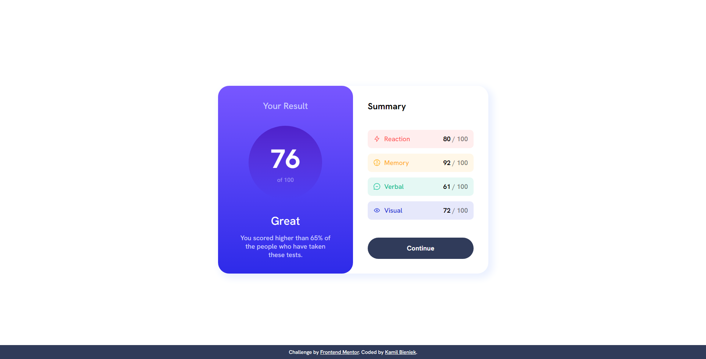
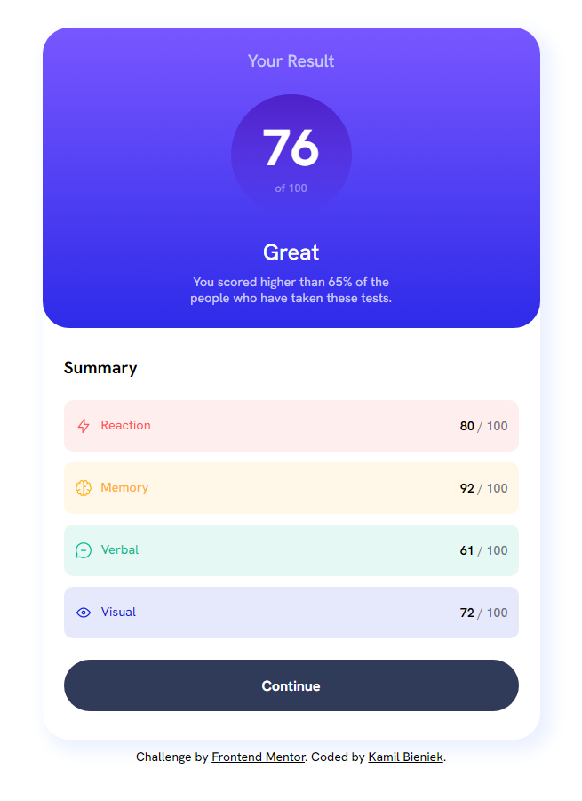
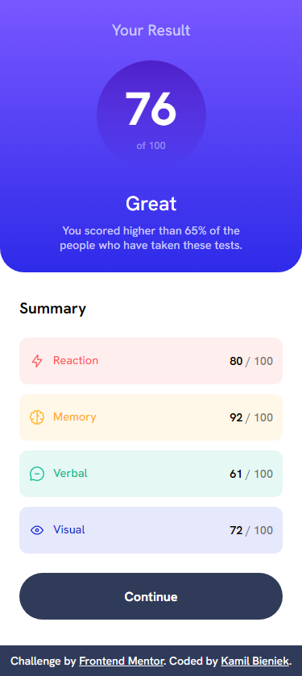

# Frontend Mentor - Results summary component solution

This is a solution to the [Results summary component challenge on Frontend Mentor](https://www.frontendmentor.io/challenges/results-summary-component-CE_K6s0maV). Frontend Mentor challenges help you improve your coding skills by building realistic projects.

## Table of contents

- [Overview](#overview)
  - [The challenge](#the-challenge)
  - [Screenshot](#screenshot)
  - [Links](#links)
- [My process](#my-process)
  - [Built with](#built-with)
- [Author](#author)

**Note: Delete this note and update the table of contents based on what sections you keep.**

## Overview

### The challenge

Users should be able to:

- View the optimal layout for the interface depending on their device's screen size
- See hover and focus states for all interactive elements on the page

### Screenshot

### Links

- Solution URL: [https://www.frontendmentor.io/solutions/results-summary-component-using-flexbox-SjV5RkGM0z](https://www.frontendmentor.io/solutions/results-summary-component-using-flexbox-SjV5RkGM0z)
- Live Site URL: [https://mrzuxii.github.io/Results-summary-component/](https://mrzuxii.github.io/Results-summary-component/)

## My Process

### Built with

- Flexbox

## Author

- Website - [Kamil Bieniek](https://www.kamilbieniek.pl/)
- Frontend Mentor - [@MrZuXii](https://www.frontendmentor.io/profile/MrZuXii)
